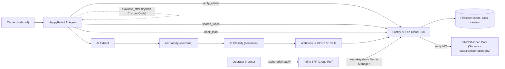

# Inbound Carrier Sales — POC

Voice-first proof of concept for a freight brokerage. An inbound carrier dials
a HappyRobot AI agent (web call), the agent verifies their MC number against
the FMCSA, pitches matching loads from a load board, negotiates pricing within
a configurable margin (max 3 rounds), mocks a transfer to a sales rep, and
ships the full call summary into Firestore. A custom React dashboard surfaces
operational KPIs in real time.

This repository contains everything needed to build, run and deploy the
end-to-end stack:

- **API** — Fastify + TypeScript service on Cloud Run.
- **Dashboard** — React + Vite SPA on Cloud Run (served by an nginx BFF that
  proxies `/api/*` to the API and injects the API key server-side, so the
  browser never holds a credential).
- **Shared types** — internal package consumed by both apps.
- **Infra** — Dockerfiles, Cloud Build configs, idempotent deploy script.
- **Local dev** — Docker Compose stack with a Firestore emulator that lets
  you run the whole flow without any GCP project.

The HappyRobot side (agent, prompt, four tools, AI Extract / AI Classify
nodes, webhook) is configured directly on the platform; this repo provides
the API surface those nodes call.

> **Note on FMCSA verification.** The canonical [FMCSA QCMobile API](https://mobile.fmcsa.dot.gov)
> requires a free webKey, but FMCSA geo-blocks non-US IP addresses at the
> network layer (returns `403` before checking credentials). With my webKey
> request still pending review and development happening from outside the
> US, I switched the carrier-verification client to FMCSA's
> [Open Data Program](https://data.transportation.gov/Trucking/FMCSA-Census-File/az4n-8mr2/about_data)
> on `data.transportation.gov` (Socrata). It exposes the same Company Census
> File that backs QCMobile, refreshed daily, with no auth and no geo-block.
> The trade-off — up to 24 h of staleness — is acceptable for carrier
> eligibility, which changes on the order of weeks. See
> [`apps/api/src/lib/fmcsa.ts`](apps/api/src/lib/fmcsa.ts) for the rationale
> and field mappings.

---

## Table of contents

1. [Architecture](#architecture)
2. [Tech stack](#tech-stack)
3. [Repository layout](#repository-layout)
4. [Prerequisites](#prerequisites)
5. [Quick start — local](#quick-start--local)
6. [Configuration reference](#configuration-reference)
7. [API surface](#api-surface)
8. [Deployment to Google Cloud Run](#deployment-to-google-cloud-run)
9. [HappyRobot configuration](#happyrobot-configuration)
10. [Dashboard usage](#dashboard-usage)
11. [Development workflow](#development-workflow)
12. [Security model & trade-offs](#security-model--trade-offs)
13. [Troubleshooting](#troubleshooting)

---

## Architecture



Key idea: **HappyRobot does the heavy lifting**. The custom backend is a
small, well-typed data service. Negotiation logic, data extraction, outcome
and sentiment classification all live as native HappyRobot nodes — easier for
non-engineers to tune, fewer moving parts to deploy.

---

## Tech stack

| Layer        | Choice                                                | Why                                                                  |
| ------------ | ----------------------------------------------------- | -------------------------------------------------------------------- |
| Voice agent  | HappyRobot platform                                   | Required by the brief; native voice + extract + classify             |
| Backend      | Node.js 20 + Fastify + Zod                            | Fast bootstrap, schema-validated tool surface for the agent          |
| Database     | Google Cloud Firestore (Native)                       | Zero-ops, fits POC scale, fast cold start on Cloud Run               |
| External     | FMCSA Open Data (Socrata)                             | Same authoritative source as QCMobile, refreshed daily, no geo-block |
| Dashboard    | React 18 + Vite + Tailwind + Recharts + React Router  | Modern UX, multi-page nav, client-side filters, 10 s live polling    |
| Hosting      | Google Cloud Run                                      | Managed HTTPS, autoscaling, integrates with Secret Manager           |
| Auth         | `x-api-key` header (constant-time compare)            | Simple, auditable, sufficient for an inbound webhook surface         |
| Local dev    | Docker Compose + Firestore emulator                   | Reproducible end-to-end without any GCP project                      |
| Build        | `gcloud builds submit` + monorepo Dockerfiles         | Reproducible builds from the repo root, no manual Artifact Registry  |
| Monorepo     | pnpm workspaces                                       | Fast installs, shared TS types between API and dashboard             |

---

## Repository layout

```
.
├── apps/
│   ├── api/                     # Fastify backend (Cloud Run service: hr-api)
│   │   ├── src/
│   │   │   ├── plugins/         # auth, errors, firestore (Fastify plugins)
│   │   │   ├── routes/          # health, carriers, loads, calls, metrics
│   │   │   ├── lib/fmcsa.ts     # FMCSA Socrata client (Open Data Program)
│   │   │   ├── scripts/         # seed-loads.ts (idempotent, with --reset-calls)
│   │   │   ├── config.ts        # env-var loader (Zod-validated)
│   │   │   └── server.ts        # Fastify bootstrap
│   │   ├── Dockerfile
│   │   ├── package.json
│   │   └── tsconfig.json
│   └── dashboard/               # React SPA (Cloud Run service: hr-dashboard)
│       ├── src/
│       │   ├── components/      # MainLayout, CallsTable, CallDetailDrawer, ...
│       │   ├── pages/           # Home, Calls, Carriers, Loads
│       │   ├── lib/             # api.ts, theme.tsx, search.tsx, data.tsx
│       │   ├── App.tsx, main.tsx, index.css
│       ├── Dockerfile
│       ├── nginx.conf.template  # SPA fallback + /api BFF (envsubst at boot)
│       └── package.json
├── packages/
│   └── shared/                  # Shared TS types (CallRecord, Load, MetricsSummary, ...)
├── infra/
│   ├── deploy.sh                # End-to-end gcloud deploy (api + dashboard)
│   ├── cloudbuild.api.yaml      # Cloud Build config for the API image
│   ├── cloudbuild.dashboard.yaml# Cloud Build config for the dashboard image
│   └── sample-loads.json        # 25 seed loads (Dry Van / Reefer / Flatbed)
├── docker-compose.yml           # Local stack: firestore-emulator + api + dashboard
├── pnpm-workspace.yaml
├── .env.example                 # Template for local config
├── .gcloudignore                # Files excluded from `gcloud builds submit`
└── README.md
```

---

## Prerequisites

| Tool             | Version  | Required for                            |
| ---------------- | -------- | --------------------------------------- |
| Node.js          | 20.x     | API, dashboard build                    |
| pnpm             | 9.x      | Monorepo install / scripts              |
| Docker           | 24+      | Local stack (`docker compose`)          |
| `gcloud` CLI     | latest   | Cloud Run / Firestore / Secret Manager  |
| A GCP project    | —        | Production deployment                   |
| (Optional) FMCSA Socrata App Token | — | Higher rate limits on FMCSA lookups (free) |

---

## Quick start — local

The fastest way to run the full stack is the Compose file at the repo root.
It boots a Firestore emulator, the API and the dashboard, all wired together
with sensible defaults. FMCSA carrier lookups go against the public Open
Data dataset on `data.transportation.gov` — no key, no VPN, no geo-block.

```bash
# 1. Install workspace dependencies
pnpm install

# 2. Copy the env template and adjust if needed
cp .env.example .env

# 3. Bring up the stack (api, dashboard, firestore emulator)
docker compose up --build -d

# 4. Seed sample loads into the emulator
FIRESTORE_EMULATOR_HOST=localhost:8085 \
FIREBASE_PROJECT_ID=local-dev \
pnpm --filter @hr/api seed

# (Optional) wipe loads + calls and reseed for a clean demo
FIRESTORE_EMULATOR_HOST=localhost:8085 \
FIREBASE_PROJECT_ID=local-dev \
pnpm reset
```

Endpoints once the stack is up:

| Service             | URL                          |
| ------------------- | ---------------------------- |
| API                 | <http://localhost:8080>      |
| Dashboard           | <http://localhost:4173>      |
| Firestore emulator  | <http://localhost:8085>      |

Open the dashboard in a browser — no setup dialog, no credentials to paste.
The dashboard's own nginx (the BFF) proxies `/api/*` to the API container
(`UPSTREAM_API=http://api:8080` from `docker-compose.yml`) and injects the
`x-api-key` header server-side from `API_KEY` in your `.env`. The browser
only ever talks to the same origin.

### Smoke-test the API

```bash
API_KEY=$(grep '^API_KEY=' .env | cut -d= -f2)

# Liveness
curl http://localhost:8080/health

# Verify a carrier (real lookup against FMCSA Open Data on Socrata)
curl -X POST http://localhost:8080/v1/carriers/verify \
  -H "x-api-key: $API_KEY" \
  -H "content-type: application/json" \
  -d '{"mc_number":"123456"}'

# Search loads
curl "http://localhost:8080/v1/loads/search?destination=Chicago&equipment_type=Dry%20Van" \
  -H "x-api-key: $API_KEY"

# Persist a synthetic call (this is what HappyRobot's webhook node does)
curl -X POST http://localhost:8080/v1/calls \
  -H "x-api-key: $API_KEY" \
  -H "content-type: application/json" \
  -d '{
    "call_id":"smoke-test-1",
    "ended_at":"2026-05-05T18:00:00Z",
    "duration_seconds":120,
    "mc_number":"123456",
    "carrier_name":"Sample Trucking",
    "load_id":"L-1001",
    "outcome":"booked",
    "sentiment":"positive",
    "final_rate":2350,
    "rounds_count":2,
    "agreed":true,
    "transcript_summary":"Carrier accepted at $2350 after a counter."
  }'
```

The synthetic call should appear in the dashboard's **Recent Calls** within
~10 seconds (live polling).

---

## Configuration reference

All configuration is environment-variable based. The same names work for
local dev (via `.env` / `docker-compose.yml`) and for Cloud Run (via
`--set-env-vars` and `--set-secrets`).

### API (`apps/api`)

| Variable                | Required | Default                                 | Notes |
| ----------------------- | -------- | --------------------------------------- | ----- |
| `NODE_ENV`              | yes      | `development`                           | `production` enables JSON logs |
| `PORT`                  | yes      | `8080`                                  | Cloud Run injects this |
| `LOG_LEVEL`             | no       | `info`                                  | `trace` / `debug` / `info` / `warn` / `error` |
| `API_KEY`               | yes      | —                                       | Shared secret, sent by HappyRobot + dashboard as `x-api-key` |
| `FIREBASE_PROJECT_ID`   | yes      | —                                       | GCP project ID (or any string when using the emulator) |
| `FIRESTORE_EMULATOR_HOST` | no    | unset                                   | Set to `host:port` to use the local emulator instead of GCP |
| `FMCSA_SOCRATA_URL`        | no    | `https://data.transportation.gov`       | Base URL for the FMCSA Company Census dataset (`az4n-8mr2`) on Socrata. |
| `FMCSA_SOCRATA_APP_TOKEN`  | no    | —                                        | Optional. A free Socrata App Token raises rate limits; not required for correctness. |
| `FMCSA_CACHE_TTL_HOURS`    | no    | `24`                                    | Cache TTL for carrier verification results in Firestore (mirrors the dataset's daily refresh). |
| `CORS_ORIGINS`          | no       | `*`                                     | Comma-separated allowlist. In Cloud Run this is set to `*` for the POC; tighten in production. |

### Dashboard (`apps/dashboard`)

The dashboard ships an nginx BFF inside its own container. The browser only
talks to the same origin (`/api/*`) — credentials never reach the browser.
nginx renders these variables at boot via `envsubst` (the official nginx
image supports `/etc/nginx/templates/*.template` out of the box):

| Variable        | Required | Default                  | Notes |
| --------------- | -------- | ------------------------ | ----- |
| `UPSTREAM_API`  | yes      | `http://localhost:8080`  | Full base URL of the API the BFF proxies to. Set by `docker-compose.yml` locally and by `infra/deploy.sh` in Cloud Run. |
| `API_KEY`       | yes      | empty                    | Injected as `x-api-key` server-side on every proxied request. Sourced from `.env` locally and from Secret Manager (`hr-api-key:latest`) in Cloud Run. |
| `PORT`          | no       | `8080`                   | Cloud Run injects this. |

The dashboard build also accepts an optional `VITE_API_BASE_URL` and a
hidden `?settings=1` URL flag for debugging — handy if you want to point
the SPA at a different API without redeploying. Day-to-day operation does
not require either.

---

## API surface

| Method | Path                            | Auth | Description                                              |
| ------ | ------------------------------- | ---- | -------------------------------------------------------- |
| `GET`  | `/health`                       | no   | Liveness probe, returns `{ "status": "ok" }`              |
| `POST` | `/v1/carriers/verify`           | yes  | Verifies an MC number against FMCSA Open Data, caches the result for 24 h |
| `GET`  | `/v1/loads/search`              | yes  | Top-N matching loads (filters: `origin`, `destination`, `equipment_type`, `pickup_after`, `max_weight`, `limit`) |
| `GET`  | `/v1/loads`                     | yes  | Lists loads ordered by pickup datetime, optional `status` filter |
| `GET`  | `/v1/loads/:load_id`            | yes  | Single load details                                      |
| `POST` | `/v1/loads/:load_id/book`       | yes  | Marks a load as booked, returns a mock transfer message  |
| `POST` | `/v1/calls`                     | yes  | Persists a call summary (passthrough schema, accepts extra HappyRobot metadata) |
| `GET`  | `/v1/calls`                     | yes  | Paginated call list with `outcome`, `sentiment` filters |
| `GET`  | `/v1/metrics/summary`           | yes  | Aggregated KPIs that power the dashboard                 |

All inputs and outputs are validated with Zod. Errors follow a uniform
envelope: `{ "error": "…", "code": "…", "message": "…" }`.

---

## Deployment to Google Cloud Run

The deploy script is idempotent — re-running it just creates a new revision.

### One-time setup (per GCP project)

```bash
gcloud auth login
gcloud auth application-default login

# Pick (or create) a project
PROJECT_ID=your-project-id
REGION=us-central1
gcloud config set project "$PROJECT_ID"

# Enable APIs (the deploy script also does this; safe to skip)
gcloud services enable \
  run.googleapis.com cloudbuild.googleapis.com \
  artifactregistry.googleapis.com containerregistry.googleapis.com \
  firestore.googleapis.com secretmanager.googleapis.com

# Create the Firestore database (Native mode)
gcloud firestore databases create --location="$REGION" --type=firestore-native

# Create the API key secret that Cloud Run mounts as an env var
echo -n "$(openssl rand -hex 32)" | gcloud secrets create hr-api-key --data-file=-

# (Optional) Add a Socrata App Token to raise FMCSA rate limits.
# Get one for free at https://data.transportation.gov/profile/app_tokens
# echo -n "<TOKEN>" | gcloud secrets create hr-fmcsa-app-token --data-file=-
```

### Deploy

```bash
PROJECT_ID="$PROJECT_ID" REGION="$REGION" ./infra/deploy.sh
```

What the script does, in order:

1. Enables the APIs above (idempotent).
2. Verifies that the `hr-api-key` secret exists (and binds the optional `hr-fmcsa-app-token` if present).
3. Grants the Cloud Run runtime service account
   (`{PROJECT_NUMBER}-compute@developer.gserviceaccount.com`) the
   `roles/secretmanager.secretAccessor` role on both secrets.
4. Builds the API image via `gcloud builds submit . --config=infra/cloudbuild.api.yaml`.
5. Deploys the API to Cloud Run with HTTPS, public ingress, the env vars and
   the Secret Manager bindings.
6. Builds the dashboard image (no API URL baked in; runtime config only).
7. Deploys the dashboard to Cloud Run with `UPSTREAM_API=<api url>` as an
   env var and `API_KEY=hr-api-key:latest` as a secret. nginx inside the
   container renders its config from those at boot.
8. Tightens the API's `CORS_ORIGINS` to the dashboard URL once it is known
   (so direct browser calls from any other origin are rejected).
9. Prints both public URLs.

### Seed the production database

Once the API is up, point the seed script at the real Firestore (it refuses
by default to avoid accidents — pass `--allow-production` explicitly):

```bash
FIREBASE_PROJECT_ID="$PROJECT_ID" \
  pnpm --filter @hr/api seed -- --allow-production
```

To wipe both `loads` and `calls` collections and reseed:

```bash
FIREBASE_PROJECT_ID="$PROJECT_ID" \
  pnpm --filter @hr/api reset -- --allow-production
```

### Rotating the API key

```bash
# 1. Add a new version
echo -n "$(openssl rand -hex 32)" \
  | gcloud secrets versions add hr-api-key --data-file=-

# 2. Roll BOTH services so they pick up :latest
gcloud run services update hr-api \
  --region="$REGION" \
  --update-secrets=API_KEY=hr-api-key:latest

gcloud run services update hr-dashboard \
  --region="$REGION" \
  --update-secrets=API_KEY=hr-api-key:latest

# 3. Update HappyRobot's API_KEY workflow variable to the new value
# (no changes needed in the browser — the BFF reads the secret, not the user)
```

---

## HappyRobot configuration

The HappyRobot workflow has five logical sections, all configured directly on
the platform. This README documents only what the API expects from each
section; the full prompt + node spec is delivered as a separate document
(`docs/HAPPYROBOT_WORKFLOW.md`).

### Workflow variables to define

| Variable     | Value                                                |
| ------------ | ---------------------------------------------------- |
| `API_URL`    | The Cloud Run URL of the API (`https://hr-api-…run.app`) |
| `API_KEY`    | The same value stored in `hr-api-key` Secret Manager |

These are referenced from tool / webhook nodes via `{{API_URL}}` and
`{{API_KEY}}`.

### Tools (Webhook tools on the agent)

All four tools live on the AI agent and call the API with `x-api-key: {{API_KEY}}`.

1. **`verify_carrier`** → `POST {{API_URL}}/v1/carriers/verify`
   Body: `{ "mc_number": "<mc>" }`. Used early in the call to decide
   whether to keep talking.

2. **`search_loads`** → `GET {{API_URL}}/v1/loads/search`
   Query params: `origin`, `destination`, `equipment_type`, `pickup_after`
   (`YYYY-MM-DD`), `max_weight`, `limit`.

3. **`evaluate_offer`** — implemented as a **Python Custom Code** node, no
   API call. Inputs: `carrier_offer`, `loadboard_rate`, `round_number`.
   Output: `{ action: "accept" | "reject" | "counter", counter_offer? }`
   using configurable knobs (`MIN_ACCEPT_RATIO=0.97`,
   `MAX_ACCEPT_RATIO=1.03`, `WALK_AWAY_RATIO=0.85`, `MAX_ROUNDS=3`).

4. **`book_load`** → `POST {{API_URL}}/v1/loads/:load_id/book`
   Body: `{ "mc_number", "agreed_rate", "carrier_name?" }`. Returns a mock
   transfer message that the agent reads back to the carrier.

### Post-call pipeline

| Node                       | Purpose                                                                                  |
| -------------------------- | ---------------------------------------------------------------------------------------- |
| `AI Extract`               | Pulls structured data from the transcript: `mc_number`, `carrier_name`, `load_id`, `final_rate`, `agreed`, `rounds_count`, `transcript_summary` |
| `AI Classify` (outcome)    | Tags the call as `booked / declined / not_eligible / no_load_found / drop_off`           |
| `AI Classify` (sentiment)  | Tags the carrier sentiment as `positive / neutral / negative`                            |
| `Webhook` → `POST /v1/calls` | Single request that ships the canonical record to the API                              |

Webhook body (copy-paste into the node, replacing classify node names if you
renamed them):

```json
{
  "call_id": "{{trigger.call_id}}",
  "ended_at": "{{trigger.ended_at}}",
  "duration_seconds": {{trigger.duration_seconds}},
  "mc_number": "{{ai_extract.mc_number}}",
  "carrier_name": "{{ai_extract.carrier_name}}",
  "load_id": "{{ai_extract.load_id}}",
  "outcome": "{{outcome_classify.label}}",
  "sentiment": "{{sentiment_classify.label}}",
  "final_rate": {{ai_extract.final_rate}},
  "agreed": {{ai_extract.agreed}},
  "rounds_count": {{ai_extract.rounds_count}},
  "transcript_summary": "{{ai_extract.transcript_summary}}"
}
```

`started_at` is intentionally omitted — the API derives it from `ended_at`
and `duration_seconds` because HappyRobot's variable picker does not expose
`started_at` directly on the trigger object.

### Calls

The brief explicitly forbids buying a phone number; the workflow uses the
**Web Call** trigger. To run an end-to-end test, hit *Publish*, open the
public Web Call URL, allow the mic, and run a sample dialogue:

> "Hi, this is MC 123456 calling about a load from Dallas to Chicago,
>  Dry Van, picking up tomorrow."

Counter at $2,150 vs a $2,000 listed rate to exercise the negotiation path.

---

## Dashboard usage

The SPA has a sidebar with four pages:

| Page             | What it shows                                                                |
| ---------------- | ---------------------------------------------------------------------------- |
| **Home**         | KPIs (calls, conversion, avg rate, avg rounds) + outcome pie + sentiment bar + calls per day + top loads |
| **Recent Calls** | Filterable table; clicking a row opens a slide-in drawer with the rounds table, the transcript rendered as chat bubbles, and the raw payload |
| **Known Carriers** | Aggregated by MC #, with revenue, sentiment breakdown, and drill-through to the Calls page (`/calls?mc=...`) |
| **Loads**        | Load board with `available / booked` toggle, served by `GET /v1/loads`        |

Other niceties:

- Light / dark theme toggle (persisted in `localStorage`, also respects
  `prefers-color-scheme`).
- Global search bar that filters the active page.
- Live updates via 10-second polling (no websockets needed).
- All API traffic goes through the same-origin BFF (`/api/*`); no API key
  is exposed to the browser. The BFF reads `API_KEY` from a Cloud Run
  secret at container start.

---

## Development workflow

```bash
# Per-app dev servers (Vite for the dashboard, tsx watch for the API)
pnpm dev

# Per-app commands
pnpm --filter @hr/api dev
pnpm --filter @hr/dashboard dev

# Type check both apps + the shared package
pnpm typecheck

# Production builds
pnpm build

# Idempotent seed / reset (refuses to run against real Firestore unless
# you pass --allow-production explicitly)
pnpm seed
pnpm reset
```

---

## Security model & trade-offs

The brief asks for *basic security features* on the API — HTTPS and API key
authentication. This POC delivers that, plus several extras:

- **HTTPS-only** via Cloud Run (managed certs, automatic HSTS).
- **`x-api-key`** enforced on every `/v1/*` route through a Fastify
  pre-handler with constant-time compare.
- **Rate limit** of 120 req/min per IP via `@fastify/rate-limit`.
- **CORS** allowlist driven by `CORS_ORIGINS`. The deploy script tightens
  it to the dashboard's Cloud Run URL after the first deploy, so direct
  browser calls from other origins are rejected.
- **Secrets** (`API_KEY`, optional `FMCSA_SOCRATA_APP_TOKEN`) bound from
  Google Secret Manager at deploy time. Never committed to the repo or
  container image.
- **Schema validation** (Zod) on every input and output.
- **Backend-for-Frontend (BFF)** in the dashboard container: nginx serves
  the SPA and proxies `/api/*` to the API, injecting `x-api-key` from a
  Cloud Run secret server-side. The browser never holds a credential —
  no Settings dialog, no `localStorage` token.
- **nginx security headers** on the dashboard
  (`X-Frame-Options: DENY`, `X-Content-Type-Options: nosniff`,
  `Referrer-Policy: strict-origin-when-cross-origin`).

### Known trade-off

HappyRobot's outbound webhook and the dashboard's BFF use the **same shared
key** (`hr-api-key`). This is acceptable for a POC (single operator, single
trusted webhook source, easily rotated with `gcloud secrets versions add`)
but would not ship as-is to production. The natural next step is to split
the key by scope:

1. `WRITE_API_KEY` for HappyRobot, allowed only on `POST /v1/calls` and
   `POST /v1/loads/:id/book`.
2. `READ_API_KEY` for the dashboard's BFF, allowed on every `GET /v1/*`.
3. Put the dashboard behind Cloud Run IAM / IAP so only authenticated
   Acme identities can reach it.

---

## Troubleshooting

| Symptom                                                              | Cause / fix                                                                                                                                                          |
| -------------------------------------------------------------------- | -------------------------------------------------------------------------------------------------------------------------------------------------------------------- |
| Dashboard shows *Failed to fetch*                                    | The BFF (nginx in the dashboard container) cannot reach `UPSTREAM_API`. In docker-compose, make sure both `api` and `dashboard` are up; in Cloud Run, confirm `UPSTREAM_API` was set on `hr-dashboard` and that it points at the API URL (`gcloud run services describe hr-dashboard --region $REGION --format='value(spec.template.spec.containers[0].env)'`). |
| Dashboard shows 401 / 403 from `/api/...`                            | The BFF is up but the `API_KEY` secret was not bound. Re-run `infra/deploy.sh` so the `--set-secrets API_KEY=hr-api-key:latest` flag is applied. Locally, make sure `API_KEY` is set in `.env`. |
| `verify_carrier` returns `fmcsa_unavailable` after 12 s              | Socrata's anonymous endpoint occasionally times out. The client retries once automatically. Persistent failures: register a free App Token at `data.transportation.gov` and bind it as `hr-fmcsa-app-token` (the deploy script picks it up automatically). |
| Seed script aborts with *"Refusing to seed/reset against Firestore"* | The script refuses to wipe a real GCP project unless you opt in. Either set `FIRESTORE_EMULATOR_HOST=...` (local) or pass `--allow-production`.                      |
| `gcloud builds submit` complains about missing files                 | Run from the repo root; the Dockerfiles assume the monorepo as the build context. The deploy script does this automatically.                                         |
| Cloud Run logs *"Permission denied on secret"*                       | The runtime service account is missing `roles/secretmanager.secretAccessor`. The deploy script grants this; re-run it.                                               |
| `pnpm reset` errors with *PERMISSION_DENIED* against Firestore       | Your shell didn't export `FIRESTORE_EMULATOR_HOST`, so the script tried to reach real GCP. Export it (`localhost:8085`) or pass `--allow-production` deliberately.   |
